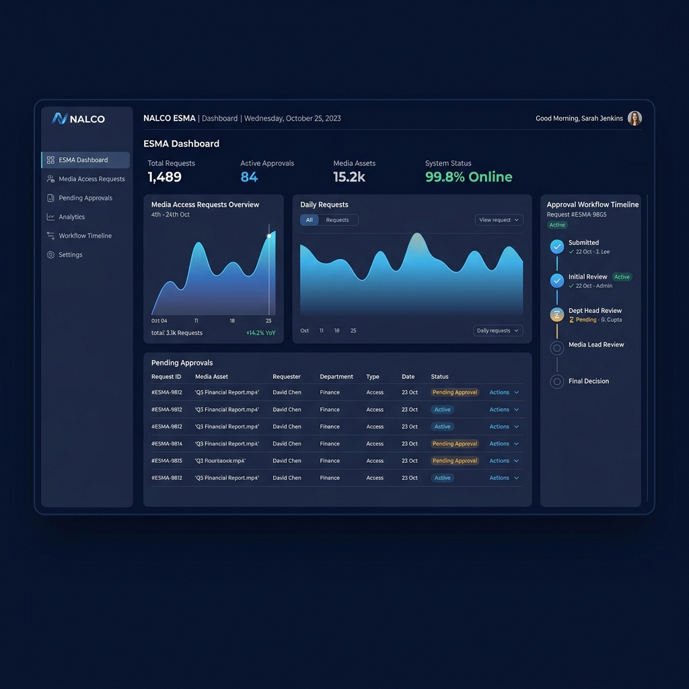
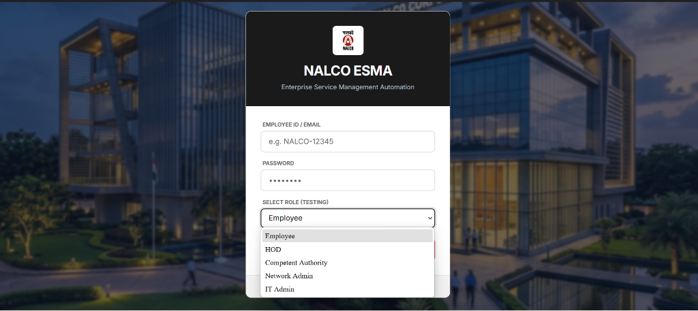
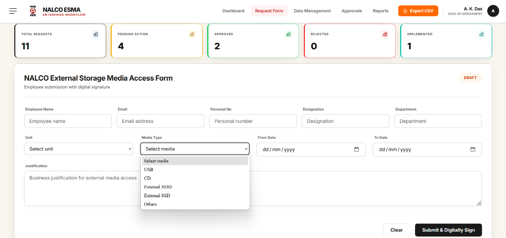
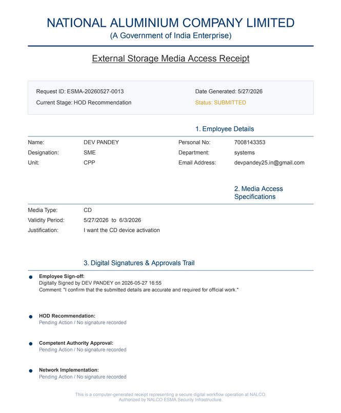
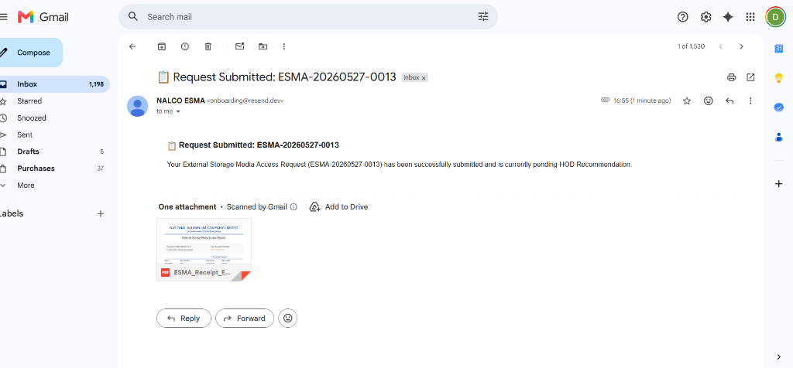
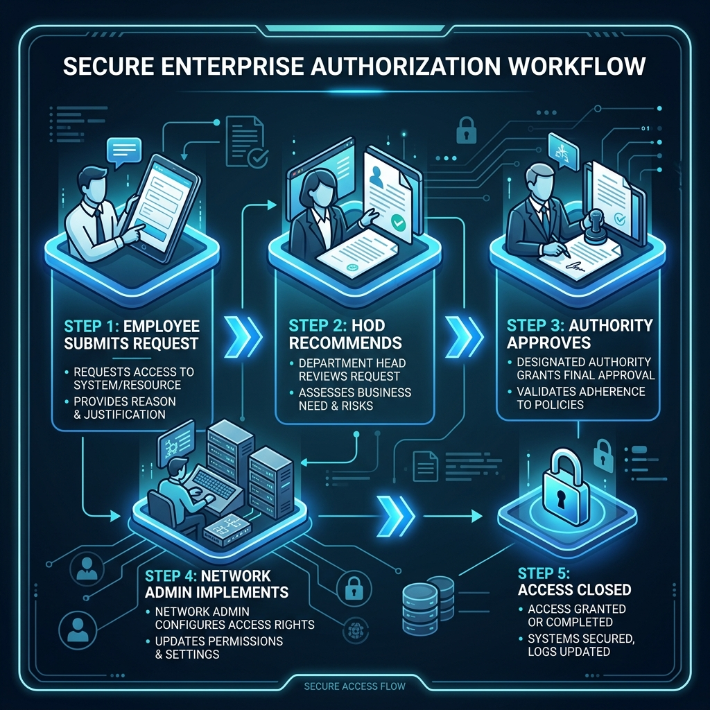

# NALCO ESMA (Enterprise System Media Access)

<div align="center">
  
</div>

## 📸 Interface Screenshots

<div align="center">
  
  
</div>
<div align="center">
  
  
</div>

---
NALCO ESMA is a full-stack, enterprise-grade workflow authorization application designed to manage, review, and audit employee requests for external storage media access (e.g., USB, CD, External HDD/SSD). 

Built with a **React-Vite** frontend and a **Node.js/Express** backend, it features multi-level cryptographic digital signing, automated email notifications, real-time state synchronization, security rate-limiting, and AI-driven transfer risk assessment.

---

## 🚀 Key Features



* **Multi-Stage Workflow Authorization:** Follows a strict organizational hierarchy:
  $$\text{Draft} \longrightarrow \text{Submitted} \longrightarrow \text{HOD Recommended} \longrightarrow \text{Authority Approved} \longrightarrow \text{Network Implemented} \longrightarrow \text{Closed}$$
* **Cryptographic Digital Signatures:** Secure, timestamped, and hashed digital signing of approvals at every level (Employee, HOD, Competent Authority, and Network Admin).
* **Automated SMTP Notifications:** Real-time email alerts delivered to users for status changes, rejections (with reapplication instructions), and approvals.
* **Real-time WebSockets Integration:** Instant updates on dashboards and notification indicators via Socket.io.
* **AI-Assisted Decision Making:** 
  * **Risk Assessment:** Analyzes justifications, request durations, and media types to generate compliance risk scores.
  * **Approval Advisor:** Suggests safety controls for HODs and Competent Authorities.
  * **Interactive Assistant:** In-app AI chatbot for corporate media policy guidance.
* **Export & Auditing:** Clean printable receipt generation and PDF exports using `jspdf` and `html2canvas` alongside automated database audit logging.

---

## 🛠️ Technology Stack

* **Frontend:** React.js, Vite, Tailwind CSS, Framer Motion, Zustand (State Management), React Hook Form + Zod (Validation), React Router DOM.
* **Backend:** Node.js, Express.js, Socket.io, Nodemailer, Bcrypt.js, JSON Web Tokens (JWT), Helmet, Express Rate Limit.
* **Database:** MongoDB (via Mongoose ODM).
* **Development Database:** Automated fallback to `mongodb-memory-server` (in-memory local MongoDB) for instant zero-configuration local runs.

---

## 🔑 Pre-Seeded User Roles (Testing Credentials)
When running in local development mode or initial production setup, the database is auto-seeded with the following accounts (all share the password `password123`):

| Role | Username / Personal No. | Designation | Purpose |
| :--- | :--- | :--- | :--- |
| **Employee** | `10845` | DM (HR) | Submits media access requests |
| **HOD** | `2001` | HOD (HR) | Recommends/Returns employee requests |
| **Competent Authority** | `3001` | CA | Grants final administrative approval |
| **Network Admin** | `4001` | Network Admin | Implements network media access blocks |
| **IT Admin** | `5001` | IT Admin | Full system administration and logs |

---

## 💻 Local Installation & Setup

### Prerequisites
* [Node.js](https://nodejs.org/) (v16+ recommended)
* [npm](https://www.npmjs.com/)

### Step 1: Clone the Repository
```bash
git clone https://github.com/DevPandey25/Nalco-ESMA.git
cd Nalco-ESMA
```

### Step 2: Backend Setup
1. Navigate to the backend directory:
   ```bash
   cd backend
   ```
2. Install dependencies:
   ```bash
   npm install
   ```
3. Create a `.env` file (copied from `.env.example` if present, or create manually):
   ```env
   PORT=5000
   NODE_ENV=development
   JWT_SECRET=your_super_secret_jwt_key
   ENCRYPTION_KEY=32_bytes_super_aes_key_for_safety
   CLIENT_URL=http://localhost:5173

   # Optional: SMTP Email configuration for local test alerts
   SMTP_HOST=smtp.gmail.com
   SMTP_PORT=587
   SMTP_USER=your-email@gmail.com
   SMTP_PASS=your-16-char-google-app-password
   ```
4. Start the backend:
   ```bash
   npm run dev
   ```
   *(Note: If no remote database is configured in `.env`, the server will automatically spin up a temporary In-Memory MongoDB server and seed the users and mock requests automatically).*

### Step 3: Frontend Setup
1. Open a new terminal and navigate to the frontend directory:
   ```bash
   cd frontend
   ```
2. Install dependencies:
   ```bash
   npm install
   ```
3. Start the frontend:
   ```bash
   npm run dev
   ```
4. Open [http://localhost:5173](http://localhost:5173) in your browser.

---

## 🌐 Production Deployment Guide

### Phase 1: Database Setup (MongoDB Atlas)
1. Sign up for a free tier database at [MongoDB Atlas](https://www.mongodb.com/).
2. Create a Database User and whitelist connection IPs (`0.0.0.0/0` for cloud services).
3. Copy your MongoDB Driver Connection URL (e.g. `mongodb+srv://<user>:<password>@cluster.mongodb.net/...`).

### Phase 2: Deploy Backend to Render
1. Create a **Web Service** on [Render](https://render.com/).
2. Connect your GitHub repository.
3. Configure the following fields:
   * **Root Directory:** `backend`
   * **Build Command:** `npm install`
   * **Start Command:** `node src/server.js`
   * **Instance Type:** `Free`
4. Add the following **Environment Variables** in the Environment tab:
   * `NODE_ENV` = `production`
   * `DB_CONNECTION_STRING` = *[Your MongoDB Atlas URL]*
   * `JWT_SECRET` = *[Generate a random long string]*
   * `ENCRYPTION_KEY` = *[Generate a random 32-character string]*
   * `SMTP_HOST` = `smtp.gmail.com`
   * `SMTP_PORT` = `587`
   * `SMTP_USER` = `your-gmail@gmail.com`
   * `SMTP_PASS` = *[Your 16-character Google App Password]*
   * `CLIENT_URL` = *[Your Vercel URL (e.g. https://your-project.vercel.app)]*

### Phase 3: Deploy Frontend to Vercel
1. Create a **Project** on [Vercel](https://vercel.com/) and import the repository.
2. Configure the following settings:
   * **Root Directory:** `frontend`
   * **Framework Preset:** `Vite`
3. Add the following **Environment Variable**:
   * `VITE_API_BASE_URL` = `https://your-render-backend-url.onrender.com/api/v1`
4. Deploy the project and copy the generated live site URL. Make sure to update the `CLIENT_URL` variable on Render with this URL!

---

## 📂 Project Structure

```text
Nalco-ESMA/
├── backend/                  # Node.js + Express API
│   ├── src/
│   │   ├── config/           # Database & WebSockets configs
│   │   ├── controllers/      # Route controllers (Auth, Requests, AI)
│   │   ├── middleware/       # JWT auth & role guards
│   │   ├── models/           # Mongoose schemas (User, Request, Audit)
│   │   ├── routes/           # REST endpoints
│   │   ├── services/         # Workflows, Nodemailer, Audit engines
│   │   └── utils/            # AES decryption / Bcrypt helpers
│   └── package.json
├── frontend/                 # React.js SPA (Vite + Tailwind)
│   ├── src/
│   │   ├── api/              # Fetch client wrappers
│   │   ├── components/       # Forms, tables, charts, signature pads
│   │   ├── hooks/            # Search filters and workflow actions
│   │   ├── pages/            # Dashboard, request form, approvals, reports
│   │   └── store/            # Zustand global state managers
│   └── package.json
└── README.md
```

---

## 👥 Contributors & Division of Labor

* **Frontend UI/UX Specialist:** Handled responsive layouts, dashboards, request forms, PDF print reports, and frontend routing structure.
* **Backend & DB Architect:** Developed the Express server base, Mongoose models, dynamic database configuration, and mock seeding.
* **State & Security Engineer:** Coded the workflow transitions engine, state machine, JWT validation middleware, rate-limiting, and client-side Zustand store sync.
* **Integration & Systems Engineer:** Created the automated nodemailer email template dispatchers, real-time WebSocket alerts, and audit logs.
* **AI & Analytics Developer:** Integrated AI compliance advice, policies chatbot, database aggregation query insights, and admin report visualizations.
